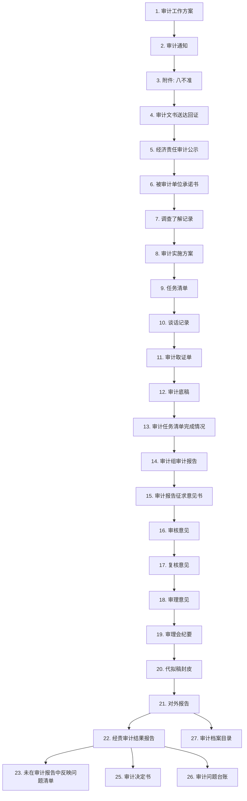

# 审计工作流程 — 按序号 1→22 顺序

## 流程总览（Mermaid）



## 五大阶段分组

### 一、审计准备阶段（步骤 1-10）

| # | 文档名称 | 子项/说明 |
|---|---------|----------|
| 1 | 审计工作方案 | 分：经济责任审计 / 预算执行和其他财政收支审计 |
| 2 | 审计通知 | 按审计类型分支：经济责任审计通知书、预算执行通知、财政收支通知、专项审计通知书 |
| 3 | 附件：八不准 | 审计"八不准"工作纪律 |
| 4 | 审计文书送达回证 | — |
| 5 | 经济责任审计公示 | 仅经济责任审计有此步骤，其他审计类型无 |
| 6 | 被审计单位承诺书 | — |
| 7 | 调查了解记录 | 含调查了解记录1（被审计单位基本情况）和调查了解记录2 |
| 8 | 审计实施方案 | — |
| 9 | 任务清单 | — |
| 10 | 谈话记录 | 含：领导班子谈话、民主测评1（旗直部门）、民主测评2（乡镇）、述职报告 |

### 二、审计实施阶段（步骤 11-14）

| # | 文档名称 | 说明 |
|---|---------|------|
| 11 | 审计取证单 | — |
| 12 | 审计底稿 | — |
| 13 | 审计任务清单完成情况 | — |
| 14 | 审计组审计报告 | — |

### 三、审计报告阶段（步骤 15-19）

| # | 文档名称 | 说明 |
|---|---------|------|
| 15 | 审计报告征求意见书 | — |
| 16 | 审核意见 | — |
| 17 | 复核意见 | — |
| 18 | 审理意见 | — |
| 19 | 审理会纪要 | — |

### 四、审计处理阶段（步骤 20-21）

| # | 文档名称 | 说明 |
|---|---------|------|
| 20 | 代拟稿封皮 | — |
| 21 | 对外报告 | 最终对外发布的审计报告 |

### 五、审计归档阶段（步骤 22-27）

| # | 文档名称 | 说明 |
|---|---------|------|
| 22 | 经责审计结果报告 | 经济责任审计专用 |
| 23 | 未在审计报告中反映问题清单 | — |
| 24 | 审计决定书 | — |
| 25 | 审计问题台账 | — |
| 26 | 审计档案目录 | — |

## 数据导入关系

```
┌─────────────────────────┐
│ 1. 审计工作方案          │ ──导入──→ 8. 审计实施方案
└─────────────────────────┘

┌────────────────────────────────┐
│ 7. 调查了解记录1                │ ──导入──→ 14. 审计组审计报告
│   (被审计单位基本情况)           │
└────────────────────────────────┘

┌──────────────────┐
│ 11. 审计取证单    │ ──导入──→ 12. 审计底稿
└──────────────────┘

┌──────────────────┐
│ 12. 审计底稿      │ ──按顺序导入──→ 14. 审计组审计报告
└──────────────────┘

┌──────────────────────┐
│ 14. 审计组审计报告    │ ──导入──→ 21. 对外报告
└──────────────────────┘

┌──────────────────────────┐
│ 21. 对外报告中的问题      │ ──自动生成──→ 问题台账
└──────────────────────────┘
```

## 与当前代码实现对照

| # | 文档名称 | 对应模板文件 | 实现状态 |
|---|---------|-------------|---------|
| 1 | 审计工作方案 | ❌ 无模板 | ❌ 未实现 |
| 2 | 审计通知 | `tpl_audit_notice.docx` | ✅ StageNotice.vue |
| 3 | 附件：八不准 | `tpl_audit_eight_prohibitions_requirements.docx` | ⚠️ 仅模板 |
| 4 | 审计文书送达回证 | `tpl_audit_document_delivery_receipt.docx` | ⚠️ 仅模板 |
| 5 | 经济责任审计公示 | `tpl_er_audit_announcement.docx` | ⚠️ 仅模板 |
| 6 | 被审计单位承诺书 | `tpl_auditee_commitment.docx` | ⚠️ 仅模板 |
| 7 | 调查了解记录 | `tpl_investigation_record_auditee_basic_info.xlsx` | ✅ StageSurvey.vue |
| — | 调查了解记录2 | `tpl_investigation_interview_record.docx` | ⚠️ 仅模板 |
| 8 | 审计实施方案 | `tpl_audit_plan.doc` | ✅ StagePlan.vue |
| 9 | 任务清单 | `tpl_task_list.xls` | ⚠️ 仅模板 |
| 10 | 谈话记录 | 民主测评×2 + 述职报告 + 领导班子谈话模板 | ⚠️ 仅模板 |
| 11 | 审计取证单 | `tpl_audit_evidence.docx` | ✅ StageEvidence.vue |
| 12 | 审计底稿 | `tpl_working_paper.docx` | ✅ StageWorkingPaper.vue |
| 13 | 审计任务清单完成情况 | `tpl_task_list_completion.xls` | ⚠️ 仅模板 |
| 14 | 审计组审计报告 | `tpl_final_report.docx` | ✅ StageReport.vue |
| 15 | 审计报告征求意见书 | `tpl_er_audit_report_consultation.docx` | ⚠️ 仅模板 |
| 16 | 审核意见 | `tpl_audit_opinion.doc` | ⚠️ 仅模板 |
| 17 | 复核意见 | `tpl_review_opinion.docx` | ⚠️ 仅模板 |
| 18 | 审理意见 | `tpl_adjudication_opinion.docx` | ⚠️ 仅模板 |
| 19 | 审理会纪要 | `tpl_adjudication_meeting_minutes.docx` | ⚠️ 仅模板 |
| 20 | 代拟稿封皮 | `tpl_draft_cover.docx` | ⚠️ 仅模板 |
| 21 | 对外报告 | ❌ 无模板 | ❌ 未实现 |
| 22 | 经责审计结果报告 | `tpl_er_result_report.docx` | ⚠️ 仅模板 |
| 23 | 未在报告中反映问题清单 | `tpl_issues_not_reflected_in_audit_report.docx` | ⚠️ 仅模板 |
| 24 | 审计决定书 | ❌ 无模板 | ❌ 未实现 |
| 25 | 审计问题台账 | ❌ 无模板 | ❌ 未实现 |
| 26 | 审计档案目录 | ❌ 无模板 | ❌ 未实现 |

## 差距总结

| 状态 | 数量 | 步骤 |
|------|------|------|
| ✅ 已实现（页面+模板） | 6 | 2, 7, 8, 11, 12, 14 |
| ⚠️ 有模板无页面 | 15 | 3, 4, 5, 6, 7-2, 9, 10, 13, 15, 16, 17, 18, 19, 20, 22, 23 |
| ❌ 无模板无页面 | 5 | 1, 21, 24, 25, 26 |
