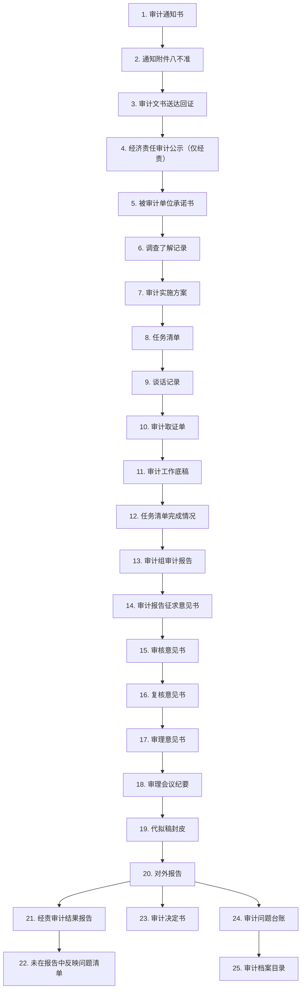

# 审计工作流程 — 25 步工作流（更新于 2026-04-29）

## 审计类型（仅三种）

1. **经济责任审计**
2. **预算执行审计**
3. **专项审计调查**

## 流程总览（Mermaid）



## 五大阶段分组

### 一、审计准备阶段（步骤 1-9）

| # | 文档名称 | 子项/说明 | 审计类型 |
|---|---------|----------|---------|
| 1 | 审计通知书 | 按审计类型选择不同模板：经济责任审计/预算执行/专项调查 | 通用 |
| 2 | 通知附件八不准 | 审计"八不准"工作纪律 | 通用 |
| 3 | 审计文书送达回证 | 文书名称和编号从通知书自动导入 | 通用 |
| 4 | 经济责任审计公示 | 仅经济责任审计有此步骤 | 经济责任审计 |
| 5 | 被审计单位承诺书 | — | 通用 |
| 6 | 调查了解记录 | 含调查了解记录1（被审单位基本情况表）、记录2（评估可能性）、记录3（审计应对措施） | 通用 |
| 7 | 审计实施方案 | 项目名称、组长、组员、开始日期从审计通知书导入 | 通用 |
| 8 | 任务清单 | 从审计方案的审计内容导入 | 通用 |
| 9 | 谈话记录 | 含：领导班子谈话、民主测评（旗直部门）、民主测评（乡镇）、述职报告 | 通用 |

### 二、审计实施阶段（步骤 10-13）

| # | 文档名称 | 说明 |
|---|---------|------|
| 10 | 审计取证单 | 项目名称从审计通知书导入 |
| 11 | 审计工作底稿 | 内容从取证单导入 |
| 12 | 任务清单完成情况 | — |
| 13 | 审计组审计报告 | — |

### 三、审计报告阶段（步骤 14-19）

| # | 文档名称 | 说明 |
|---|---------|------|
| 14 | 审计报告征求意见书 | 附送达回证 |
| 15 | 审核意见书 | — |
| 16 | 复核意见书 | — |
| 17 | 审理意见书 | — |
| 18 | 审理会议纪要 | — |
| 19 | 代拟稿封皮 | — |

### 四、审计处理阶段（步骤 20-24）

| # | 文档名称 | 说明 |
|---|---------|------|
| 20 | 对外报告 | 预算执行对外报告 |
| 21 | 经责审计结果报告 | 经济责任审计专用 |
| 22 | 未在报告中反映问题清单 | — |
| 23 | 审计决定书 | 特殊情况需要 |
| 24 | 审计问题台账 | — |

### 五、审计归档阶段（步骤 25）

| # | 文档名称 | 说明 |
|---|---------|------|
| 25 | 审计档案目录 | — |

## 数据导入关系

```
┌─────────────────┐
│ 1. 审计通知书    │ ──导入──→ 3. 送达回证（文书名称、文号）
│                 │ ──导入──→ 4. 经济责任审计公示
│                 │ ──导入──→ 7. 审计实施方案（项目名称、组长、组员、开始日期）
│                 │ ──导入──→ 10. 审计取证单（项目名称）
└─────────────────┘

┌──────────────────────┐
│ 6. 调查了解记录       │ ──导入──→ 7. 审计实施方案
│ 7. 审计实施方案       │ ──导入──→ 8. 任务清单（审计内容）
└──────────────────────┘

┌──────────────────┐
│ 10. 审计取证单    │ ──导入──→ 11. 审计工作底稿
└──────────────────┘

┌──────────────────┐
│ 11. 审计底稿      │ ──按顺序导入──→ 13. 审计组审计报告
│ 6. 调查了解记录   │ ──导入──→ 13. 审计组审计报告
│ 10. 审计取证单    │ ──导入──→ 13. 审计组审计报告
└──────────────────┘

┌──────────────────────┐
│ 13. 审计组审计报告    │ ──导入──→ 20. 对外报告
└──────────────────────┘

┌──────────────────────────┐
│ 20. 对外报告中的问题      │ ──自动生成──→ 审计问题台账
└──────────────────────────┘
```

## 模板文件命名对照表（标准化命名：数字编号+中文）

| 步骤 | 文档名称 | 模板文件名 |
|------|---------|-----------|
| 1 | 审计通知书 | `1经济责任审计通知书.docx` / `2预算执行通知书.docx` / `3专项审计调查通知书.docx` |
| 2 | 通知附件八不准 | `4通知附件八不准.docx` |
| 3 | 审计文书送达回证 | `5审计文书送达回证.docx` |
| 4 | 经济责任审计公示 | 无模板 |
| 5 | 被审计单位承诺书 | `6被审计单位承诺书.docx` |
| 6 | 调查了解记录 | `7调查了解记录1基本情况表.xlsx` / `8调查了解记录2评估可能性.docx` / `9调查了解记录3审计应对措施.docx` |
| 7 | 审计实施方案 | `10审计实施方案.docx` |
| 8 | 任务清单 | 无模板 |
| 9 | 谈话记录 | 无模板 |
| 10 | 审计取证单 | `11审计取证单.docx` |
| 11 | 审计工作底稿 | `12审计工作底稿.docx` |
| 12 | 任务清单完成情况 | `13任务清单完成情况.xls` |
| 13 | 审计组审计报告 | 无模板 |
| 14 | 审计报告征求意见书 | `14审计报告征求意见书.docx` |
| 15 | 审核意见书 | `15审核意见书.docx` |
| 16 | 复核意见书 | `16复核意见书.docx` |
| 17 | 审理意见书 | `17审理意见书.docx` |
| 18 | 审理会议纪要 | `19审理会议纪要.docx` |
| 19 | 代拟稿封皮 | `18代拟稿封皮.docx` |
| 20 | 对外报告 | `20预算执行对外报告.docx` |
| 21 | 经责审计结果报告 | 无模板 |
| 22 | 未在报告中反映问题清单 | 无模板 |
| 23 | 审计决定书 | 无模板 |
| 24 | 审计问题台账 | 无模板 |
| 25 | 审计档案目录 | 无模板 |

## 与当前代码实现对照（更新于 2026-04-29）

| 状态 | 数量 | 步骤 |
|------|------|------|
| ✅ 已实现（独立页面 + 独立表） | 2 | 取证单(10)、底稿(11) |
| ✅ 已实现（通用表单 + 模板） | 15 | 通知书(1)、八不准(2)、送达回证(3)、承诺书(5)、调查记录(6)、实施方案(7)、任务清单(8)、谈话记录(9)、征求意见书(14)、审核意见书(15)、复核意见书(16)、审理意见书(17)、会议纪要(18)、代拟稿封皮(19)、对外报告(20) |
| ✅ 已实现（通用表单，无模板） | 6 | 公示(4)、任务清单完成情况(12)、审计报告(13)、结果报告(21)、未反映问题清单(22)、审计决定书(23)、问题台账(24)、档案目录(25) |

## 界面设计规范（更新于 2026-04-29）

### 系统名称与标识

- **系统名称**：基层审计机关审计辅助系统
- **落款单位**：科右前旗审计局
- **版本号**：v0.1
- **Logo**：位于页面左上角，使用 `public/logo.png`（圆形国徽样式，金色边框）

### 视觉风格

| 元素 | 设计规范 |
|------|---------|
| **主色调** | 深红（#8B0000 → #B22222 渐变）+ 金色（#FFD700） |
| **背景** | 暖米色（#f5f0e8）+ 华表柱纹理（repeating-linear-gradient 网格） |
| **页面头部** | 深红渐变背景，金色标题文字，华表柱装饰纹理（radial-gradient 云纹） |
| **金色装饰线** | 头部底部和页脚顶部均有 2px 金色渐变横线 |
| **卡片风格** | 白色→浅暖渐变，红色左边框，金色圆角，微阴影 |
| **按钮** | 红色渐变背景，金色文字，悬停上浮效果 |
| **标签配色** | 进行中：琥珀色背景；已完成：绿色背景；未开始：灰色背景 |
| **字体** | Microsoft YaHei / PingFang SC / Hiragino Sans GB |

### 页面级样式

| 页面 | 设计特征 |
|------|---------|
| **全局布局** | 顶部红色header（Logo + 标题 + 返回首页按钮），底部红色footer（版权信息） |
| **Home.vue** | 项目列表网格卡片，红色标题栏弹窗，状态标签（进行中/已归档/草稿） |
| **ProjectDetail.vue** | 红色渐变阶段Tab导航，编号圆形徽章，步骤项悬停右移效果 |
| **StageView.vue** | 通用表单布局，红色聚焦输入框边框，保存/编辑切换 |

### 组件 CSS 命名规范

所有自定义 CSS 类使用 `.gov-` 前缀，确保全局唯一性：
- `.gov-header` — 顶部导航栏
- `.gov-page-header` — 页面标题区
- `.gov-project-card` — 项目卡片
- `.gov-stage-panel` — 阶段面板
- `.gov-phase-tabs` — 阶段Tab
- `.gov-modal` — 弹窗
- `.gov-btn-create` / `.gov-btn-cancel` / `.gov-btn-confirm` — 按钮

## 待修复问题

| 优先级 | 问题 | 修复方案 |
|--------|------|---------|
| P1 | 调查数据孤岛：survey_records 独立表 vs stage_progress.data_json | 统一数据源或同步机制 |
| P1 | 取证单/底稿独立表，stage_progress 中对应行为空，report 自动导入失效 | 重构 autoImport 逻辑，支持从独立表读取 |
| P2 | 阶段状态永远不 "completed" | 增加完成标记逻辑 |
| P2 | 文件附件无前端 UI | 增加上传/管理组件 |
| P2 | 模板占位符为 ** 格式，需转换为 docxtemplater 的 {xxx} | 逐文件处理 Word XML |
| P3 | StageNotice/StageSurvey/StagePlan/StageReport 为死代码 | 删除 |
| P3 | 13对审计报告的签证意见书.rtf 编号冲突 | 重新编号 |
